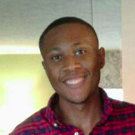

---
# Feel free to add content and custom Front Matter to this file.
# To modify the layout, see https://jekyllrb.com/docs/themes/#overriding-theme-defaults

layout: home
title: 
---

# Welcome!

 Hi, I'm Mike! I'm an Applied Machine Learning and AI Scientist, here in New York City. This is my notebook, where I try things, fail, and try again, then write about it.

---

## Background
I lead a generative AI research and development lab that drives innovation for products within the Consumer Analytics organization, at CVS Health. Having worked at the staff level, as both a data engineer and data scientist, I developed a passion for building 0-1 intelligenent systems that help people. My current interest is Subjective Content generation and measurement to scale human-centered applicaiton development.

Outside of work, I love being outdoors, lifting weights, and playing music. Jazz piano and marching percussion have been a huge part of my life for over 20 years.

## Education
Aside from my profressional and personal life, I am currently Ph.D. Candidate at Florida Atlantic University, under Dr.’s Taghi Khoshgoftaar and Joseph Prusa. My research focuses on applying systemic and subjective phenomena to learning methods for Large Language Models.

- **Ph.D. Computer Science**, Candidate, Machine Learning, Florida Atlantic University 
- **M.S. Computer Science**, Machine Learning,  Florida Atlantic University
- **B.S. Electrical and Computer Engineering**, University Florida 

## Research Interests
- Human-centered LLM Measurement
- Cross-modal Data Augmentation Methods 
- Transductive Denoising for Semi and Unsupervised Learning
- Information Retrieval

---
